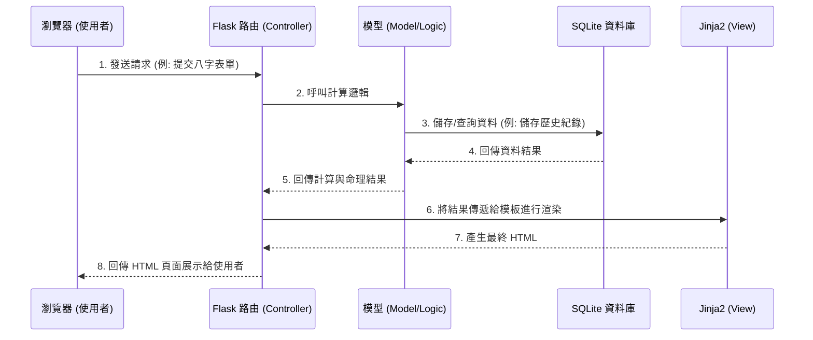

# 系統架構設計 - 線上算命系統

## 1. 技術架構說明
### 選用技術與原因
- **後端框架：Python + Flask**
  - **原因**：輕量級、具備高彈性與快速開發特性，非常適合中小型 Web 專案或 MVP (最小可行性產品)。Python 豐富的生態圈也有利於未來需要複雜命理演算法時引入額外模組。
- **模板引擎：Jinja2**
  - **原因**：Flask 內建，能夠將伺服器端的資料輕鬆渲染到 HTML 畫面上。不需要建立龐大的前後端分離框架（如 React/Vue），降低開發門檻且利於 SEO。
- **資料庫：SQLite**
  - **原因**：無需額外架設資料庫伺服器，資料儲存在單一檔案，非常適合初期的輕量級產品和概念驗證階段。
- **前端技術：HTML / CSS / Vanilla JavaScript**
  - **原因**：搭配 Jinja2，輔以少量的 Vanilla JS 實現例如「一鍵分享」、互動特效或簡單表單驗證等輕度前端邏輯即可。

### Flask MVC 模式說明
雖然 Flask 本身是微框架，但我們在此專案中會採用類似 **MVC (Model-View-Controller)** 的概念來組織程式碼：
- **Model (模型)**：負責處理命理邏輯、八字計算演算法以及與 SQLite 的資料庫互動（例如讀寫歷史紀錄）。
- **View (視圖)**：負責將處理好的資料呈現給使用者（包含 HTML + Jinja2 模板，與 CSS/JS 等靜態資源）。
- **Controller (控制器/路由)**：負責接收使用者的網頁請求（HTTP Request），呼叫 Model 取得運算結果或資料，然後將資料傳遞給 View 進行頁面渲染，最後回傳 HTTP Response 給使用者。

## 2. 專案資料夾結構
為了保持專案結構清晰，我們將分離不同職責的程式碼，採用以下推薦的資料夾架構：

```text
web_app_development/
├── app/
│   ├── models/           ← 資料庫模型與核心演算法（例如: fortune.py 命理邏輯、history.py 紀錄模型）
│   ├── routes/           ← Flask 路由（Controller），接收請求並串接 Model 與 View（例如: views.py）
│   ├── templates/        ← Jinja2 HTML 模板檔（View）
│   │   ├── base.html     ← 共用版面（標題、導覽列、頁尾等）
│   │   ├── index.html    ← 首頁
│   │   ├── result.html   ← 算命/占卜結果頁
│   │   └── history.html  ← 歷史紀錄頁
│   └── static/           ← 靜態資源檔案
│       ├── css/          ← 樣式表檔案
│       ├── js/           ← 客製化 JavaScript 檔案
│       └── images/       ← 專案圖片素材（如占卜抽籤圖示）
├── instance/
│   └── database.db       ← SQLite 資料庫檔案
├── docs/                 ← 專案文件目錄（包含 PRD, 架構文件等）
├── requirements.txt      ← Python 相關套件依賴清單
└── app.py                ← 專案主程式入口點
```

## 3. 元件關係圖

以下展示各系統元件彼此之間的關聯與資料流向：



## 4. 關鍵設計決策

1. **整合式後端渲染 (Server-Side Rendering)**：
   - 不採用前後端分離，直接讓 Flask 透過 Jinja2 將畫面和資料結合後再送出。這不僅開發速度快，對於純粹展示內容（如命理結果）或需要依賴搜尋引擎排名的系統來說，也是直觀有效的做法。

2. **核心命理邏輯解耦 (Decoupling)**：
   - 儘管是小型專案，仍然強制將與路由 (`routes/`) 無關的八字換算與算命演算法拆分至獨立檔案（集中於 `app/models/`）。這樣做能方便後續針對演算法進行單元測試，若未來增加不同的命理模組也不會污染路由檔。

3. **使用 Session 管理短期歷史紀錄**：
   - 在 MVP 階段，為了降低開發難度與使用者門檻，暫不建構完整的會員註冊/登入系統。對於「歷史紀錄檢視」，將利用 Flask Session 先行記錄，讓未登入的使用者在一定時間內仍能檢視先前的算命紀錄。

4. **資料本地化 (SQLite)**：
   - 目前只需滿足系統基本的資料存儲，無複雜寫入衝突，因此採用輕量化的 SQLite，放在 instance 目錄內。這減輕了維護伺服資料庫的心智負擔，快速驗證產品。
