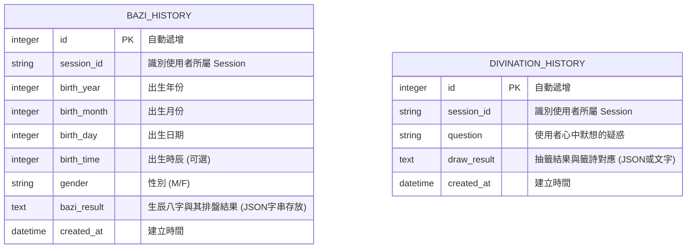

# 資料庫設計 - 線上算命系統

根據目前的架構與需求，系統採無會員制，歷史紀錄依賴 Session 來追蹤。我們需要紀錄使用者的算命結果（八字排盤）與占卜結果（籤詩）。以下為 SQLite 資料庫結構設計。

## 1. ER 圖（實體關係圖）

## 2. 資料表詳細說明

### `bazi_history` (八字算命紀錄表)
用於儲存使用者每次提交生辰八字的輸入與所計算出的命運解析結果。
- `id` (INTEGER): Primary Key。
- `session_id` (TEXT): 必填，用來匹配未登入使用者的歷史紀錄。
- `birth_year` (INTEGER): 必填。
- `birth_month` (INTEGER): 必填。
- `birth_day` (INTEGER): 必填。
- `birth_time` (INTEGER): 非必填（儲存 0-23 小時或對應數字）。
- `gender` (TEXT): 必填，因為八字大運計算通常仰賴性別（順逆行不同）。
- `bazi_result` (TEXT): 必填，將分析結果序列化為字串或 JSON 儲存，以便頁面渲染。
- `created_at` (DATETIME): 必填，預設為當前時間。

### `divination_history` (線上占卜紀錄表)
用於儲存使用者提出的問題與獲得的籤詩解答。
- `id` (INTEGER): Primary Key。
- `session_id` (TEXT): 必填，用來匹配使用者的操作連線。
- `question` (TEXT): 必填，紀錄使用者當時詢問的事情。
- `draw_result` (TEXT): 必填，紀錄算出的籤號或完整的籤詩與解釋內容。
- `created_at` (DATETIME): 必填，預設為當前時間。
