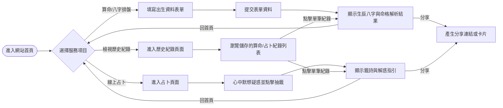
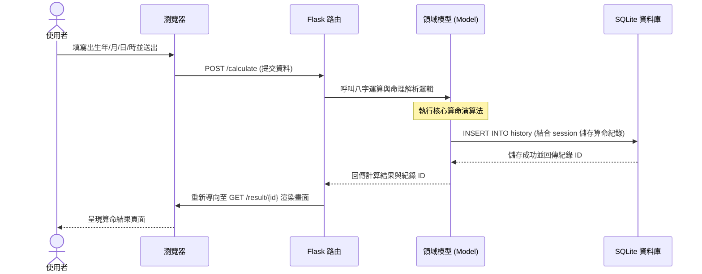

# 系統與使用者流程圖 - 線上算命系統

本文件根據 PRD 與系統架構文件，視覺化使用者在「線上算命系統」中的操作路徑與系統內部的資料流動。

## 1. 使用者流程圖（User Flow）

以下圖表展示使用者從進入網站開始，如何操作各項主要功能（生成八字、算命、占卜、歷史紀錄檢視、分享）。

## 2. 系統序列圖（Sequence Diagram）

以下圖表描述「使用者提交出生日期進行算命」到「系統產生結果並記錄」的完整系統互動過程。

## 3. 功能清單對照表

下表列出系統各主要功能、預期的對應 URL 路徑及其 HTTP 操作方法：

| 功能模組 | 功能描述 | URL 路徑 | HTTP 方法 |
| --- | --- | --- | --- |
| **首頁** | 進入系統的第一個頁面，展示服務選項 | `/` | GET |
| **算命服務** | 提交使用者的出生時間進行計算 | `/calculate` | POST |
| **算命服務** | 顯示與呈現八字/算命分析結果 | `/result/<id>` | GET |
| **占卜服務** | 進入抽籤/占卜頁面 | `/divination` | GET |
| **占卜服務** | 執行抽籤邏輯並產生結果 | `/divination/draw` | POST |
| **占卜服務** | 顯示與呈現籤詩/占卜回答 | `/divination/<id>` | GET |
| **歷史紀錄** | 列出當前 Session 保存的測算紀錄 | `/history` | GET |
| **分享功能** | 公開檢視特定結果 (與查看本人結果共用) | `/share/<type>/<id>` | GET |
